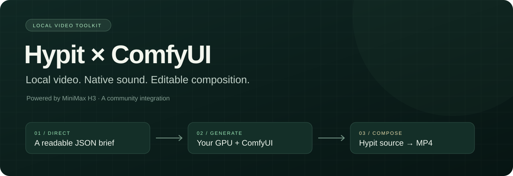
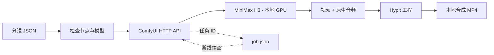

<div align="center">



# Hypit × ComfyUI Local

**用自己的显卡生成视频，把剪辑留在可编辑的工程里。**

MiniMax H3 原生音画 · ComfyUI 本地推理 · Hypit 可编辑合成


[](https://github.com/jijuxie/hypit-comfyui-local/actions/workflows/test.yml)

[快速开始](#快速开始) · [工作原理](#工作原理) · [功能边界](#功能边界) · [故障排查](docs/troubleshooting.md)

</div>

---

输入一份分镜描述，在已经配置好的 ComfyUI 中运行 MiniMax H3，得到带原生音频的短片，并自动导出 Hypit 的 `.svml`、`.svs`、`.svrun` 工程文件。素材生成和成片合成可以分别重跑，改剪辑时不必重新消耗 GPU 生成素材。

这是社区编写的独立桥接工具，与 Hypit、ComfyUI、MiniMax 均无官方隶属关系。**当前版本采用“先生成素材，再导入 Hypit”的路线；不是 Hypit 内置 Provider，也没有宣称一键复刻任意视频。**

## 为什么做这个项目

| 你想要的 | 这里的做法 |
| --- | --- |
| 使用现有 ComfyUI 和模型 | 连接已有 HTTP 服务，校验节点与模型文件名 |
| 保留 H3 的雨声、音乐和对白 | 视频与音频分别解码，再一起保存；Hypit 显式接入音轨 |
| 看懂并修改生成流程 | 同时保存 API JSON 和可在 ComfyUI 打开的 GUI JSON |
| 断线后继续等待 | 把 `prompt_id` 落盘，`resume` 只跟踪原任务 |
| 重做剪辑而不重新生成 | 输出独立 Hypit 工程，素材和合成分开管理 |
| 分享工程而不泄露本机路径 | 通用配置提交仓库，机器路径和生成结果默认忽略 |

## 工作原理



桥接层只用 Node.js 标准库。Hypit、FFmpeg 和 FFprobe 由锁定版本的开发依赖提供；第一次准备 Hypit 合成环境还会下载其选定的浏览器与渲染引擎。示例运行不配置任何云端生成服务。

## 快速开始

### 1. 准备环境

- Node.js **22.15 或更新版本**，建议 Node.js 24。
- 已启动、能正常生成 H3 视频的 ComfyUI，默认地址 `http://127.0.0.1:8188`。
- 已自行取得和安装兼容的 H3 权重、文本编码器、视频/音频 VAE 及 Turbo LoRA。

本项目**不分发模型、不自动升级 ComfyUI、不启动或重启你的 ComfyUI**。模型文件清单见 [`config.example.json`](config.example.json)。示例编码器使用 NVIDIA Blackwell 的 NVFP4 格式，其他显卡应换成自身环境支持的版本。

```bash
git clone https://github.com/jijuxie/hypit-comfyui-local.git
cd hypit-comfyui-local
npm ci
npm run doctor
```

`doctor` 会实时检查所需节点和模型名称；不会排队生成或加载全部权重。

### 2. 生成原创样片

```bash
npm run demo
```

示例是 **《雨夜的一杯温暖》**：咖啡杯、雨窗、暖色灯光、缓慢推进的镜头，保留模型生成的雨声和轻柔钢琴。提示词、种子、尺寸、时长全部在 [`examples/rainy-cafe.json`](examples/rainy-cafe.json) 中可编辑。

| 参数 | 示例值 |
| --- | --- |
| 尺寸 | 864 × 480 |
| 帧率 | 24 fps |
| 目标时长 | 5 秒 |
| 实际帧数与时长 | 124 帧，约 5.167 秒 |
| 采样 | `res_multistep` / `simple` / Turbo 8 步 |
| 声音 | H3 原生音频，未替换成系统 TTS |

H3 帧数按 `17k + 5` 向上对齐，因此实际时长可能略长于输入。合成工程使用实际帧数，避免结尾截断。

输出放在独立时间戳目录：

```text
output/rainy-cafe-<timestamp>/
├── job.json             # 任务 ID、种子、实际帧数与结果校验值
├── workflow.api.json    # ComfyUI API 工作流
├── workflow.json        # 可在 ComfyUI 中打开的工作流
├── source.mp4           # 生成素材，保留原生声音
└── hypit/
    ├── main.svml        # 画面和音轨的合成源文件
    ├── look.svs         # 画面样式
    └── build.svrun      # 最终视频构建目标
```

如果 ComfyUI 返回 WebM/MKV，工具保留真实扩展名，并自动更新工程引用。

### 3. 用 Hypit 合成

```bash
node bin/setup-hypit.mjs
npm run hypit -- runtime use hypit.runtime.local.json
npm run hypit -- runtime up
```

第一次 `runtime up` 会准备本地渲染依赖。将下面的 `<job>` 替换为命令输出中的真实目录名：

```bash
npm run hypit -- check "output/<job>/hypit/main.svml"
npm run hypit -- plan "output/<job>/hypit/build.svrun"
npm run hypit -- build "output/<job>/hypit/build.svrun" --follow
npm run hypit -- get <build-id> --output final.video --to "output/<job>/final.mp4"
```

`build-id` 由 Hypit 输出。再次执行 build 只重新合成已有素材；不会调用桥接脚本重新生成 H3 视频。

也可以用封装命令完成构建与导出，并记录 Hypit Build 回执：

```bash
npm run render -- "output/<job>"
```

已有 `final.mp4` 时，新导出以 Build ID 命名，保留旧成片。若 Build 完成而下载中断，可运行 `npm run render -- "output/<job>" --export`，只导出上次已记录的 Build。

## 自定义与恢复

复制 `config.example.json` 为 `config.local.json`，修改服务地址、模型文件名或等待超时。该文件默认不提交 Git。

可增加 `workflowDirectory` 指向你的 `ComfyUI/user/default/workflows`，每次准备时自动把 GUI 工作流保存到 ComfyUI 的 Workflows 列表。环境变量 `COMFY_HOST` 优先于配置中的 `host`，`LOCAL_VIDEO_CONFIG` 可指定配置文件。

```bash
# 只检查并导出工作流，不生成
node bin/local-video.mjs prepare examples/rainy-cafe.json

# 使用自己的描述
node bin/local-video.mjs run examples/my-shot.json

# 断线后跟踪原任务，不再次提交
node bin/local-video.mjs resume "output/<job>/job.json"
```

图生视频：先通过 ComfyUI 上传图片，在分镜 JSON 增加 `"firstFrame": "your-image.png"`。这里填写 ComfyUI input 中的文件名，不是电脑绝对路径。工具会添加 `LoadImage` 并连接首帧；提示词需按 H3 图生视频格式加入参考首帧说明。此路径已做结构测试，实际图生效果需要在你的模型配置上验证。

更多参数、分镜组织和参考视频改编方法见 [使用指南](docs/usage.md)。

## 功能边界

| 能力 | 当前范围 |
| --- | --- |
| H3 文生视频 | 已实现，附原创 480P 示例 |
| H3 图生视频 | 支持 ComfyUI 已上传首帧，未自动上传文件 |
| 任务恢复 | 已提交任务的查询与下载恢复；不自动重试生成 |
| 原生音频 | 工作流与合成工程均保留 |
| Hypit 导出 | 单镜头工程；可继续编辑画面、时序和音轨 |
| 视频参考 / Ref2VA | 后续扩展，当前 CLI 尚未实现 |
| 自动拆镜 / 字幕识别 | 尚未实现，需另外准备分镜与转写 |
| Hypit 原生 Provider | 后续扩展，当前采用素材导入方式 |
| 1080P / 2K 生成 | 不作承诺；画布放大不等于模型原生高分辨率 |

初始验证环境是 Windows、RTX 5070 Laptop 8GB、32GB RAM、ComfyUI 0.37.4、Hypit 0.2.16。8GB 显存运行大模型会依赖内存卸载，速度取决于模型量化、工作流和系统负载；这不是对其他机器的性能保证。运行记录见 [验证记录](docs/validation.md)。

## 开发

```bash
npm test
```

测试覆盖帧数约束、错误参数、图连接、音频链路、异步提交/查询/下载、失败与超时，以及合成文件导出。HTTP 测试使用模拟 ComfyUI 服务，不消耗 GPU；GitHub Actions 在 Windows 和 Linux 上运行这些测试。真实模型生成与 Hypit 渲染需本地环境验证。

```text
bin/          命令行入口和本机配置脚本
src/          ComfyUI 客户端、工作流构建与 Hypit 导出
examples/     可修改的原创分镜描述
docs/         使用说明、排障、验证记录与项目视觉
test/         无 GPU 的协议与行为测试
```

## 致谢与许可

- [Hypit](https://github.com/hypit-ai/hypit)：视频创作与合成系统。
- [ComfyUI](https://github.com/Comfy-Org/ComfyUI)：本地工作流与模型执行。
- [MiniMax H3](https://huggingface.co/MiniMaxAI/MiniMax-H3)：原生音画生成。Powered by MiniMax H3。
- [LightX2V](https://huggingface.co/lightx2v/Minimax-h3-Turbo)：Turbo 加速 LoRA。

原创桥接代码、文档与 SVG 使用 [MIT](LICENSE)。这不改变 Hypit、模型、LoRA、FFmpeg 或其他依赖各自的许可证。

**MiniMax H3 采用专用社区许可，包含地区及生成输出使用条件。**请在下载、运行和公开发布前阅读[模型许可](https://huggingface.co/MiniMaxAI/MiniMax-H3/blob/main/LICENSE)。公开仓库默认只保存代码、原创文字示例和工程说明；模型权重、生成视频、本机配置和私人素材不纳入提交。参见 [第三方说明](THIRD_PARTY_NOTICES.md)。
